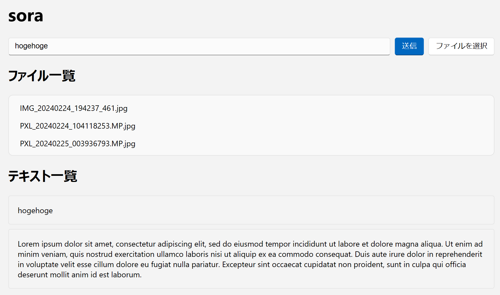
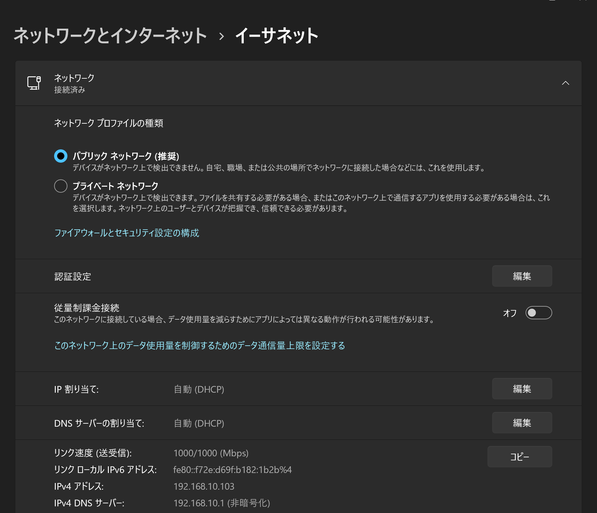

# sora
[](https://github.com/Himeyama/sora/actions/workflows/main.yml)
[](https://badge.fury.io/rb/sora)

> 

sora は文字列やファイルを送受信できる Ruby 製 http サーバです。

sora (Server Of Ruby for Access) は、ファイルの送受信や、文字列を送信して情報を伝達することができます。

- https://rubygems.org/gems/sora

## インストール
この gem は Windows と Linux で動作確認をしています。

### インストール方法
```ps1
gem install sora
```

または

```ps1
rake install # リポジトリからインストールする
```

## sora とは
sora はインストールされたマシンでサーバーを立ち上げる。
そのマシンにLAN 内にあるスマホや他のマシンからアクセスすることで文字列やファイルを共有できます。

次のコマンドは、sora サーバーを 8001 ポートで立ち上げるコマンドです。

```ps1
sora -p 8080 # または: sora
```

次にブラウザで、sora にアクセスしてみましょう。

sora をインストールしたマシンでは、以下の url から sora にアクセスできます。

[http://127.0.0.1:8080/](http://127.0.0.1:8080/)

他の端末からはインストールしたマシンの IP アドレスを取得してアクセスします。
IP アドレスは Windows の「設定」から確認可能で、「IPv4 アドレス」が対象の IP アドレスです。
コンソールで `ipconfig` を実行して確認してもよいです。



## 開発
以下、開発者向けの説明です。

- Windows
- Ruby 3.2.3

### 依存パッケージのインストール
```ps1
bundle install
```

### アプリの実行 
```ps1
bundle exec sora
```

### Webpack でスクリプトをコンパイル
```ps1
rake build:webpack
```

