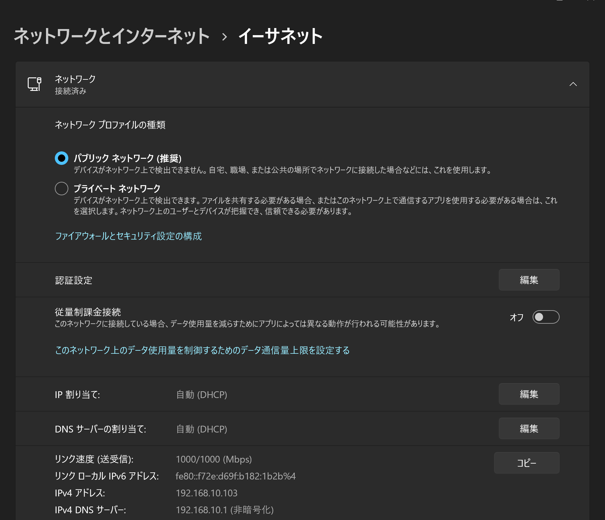

# sora
[](https://github.com/Himeyama/sora/actions/workflows/main.yml)
[](https://badge.fury.io/rb/sora)

> 

[日本語の README](/README.ja.md)

sora is an http server in Ruby that can send and receive strings and files.

sora (Server Of Ruby for Access) can send and receive files, and transmit text strings to communicate information.

- https://rubygems.org/gems/sora

## Installation
This gem is supported on Windows and Linux.

### How to Install
```ps1
gem install sora
```

or

```ps1
rake install # Install from repository
```

## About sora
Sola sets up a server on the installed machine. Strings and files can be shared by accessing that machine from smartphones or other machines in the LAN.

The following command will bring up the sora server on port 8080.

```ps1
sora -p 8080 # or: sora
```

Next, let's access sora with a browser.

On a machine with sora installed, you can access sora from the following url.

[http://127.0.0.1:8080/](http://127.0.0.1:8080/)

From other terminals, the IP address of the installed machine is obtained and accessed.
The IP address can be checked from the Windows `Settings`, where `IPv4 address` is the target IP address.
You can also check it by running `ipconfig` in the console.


